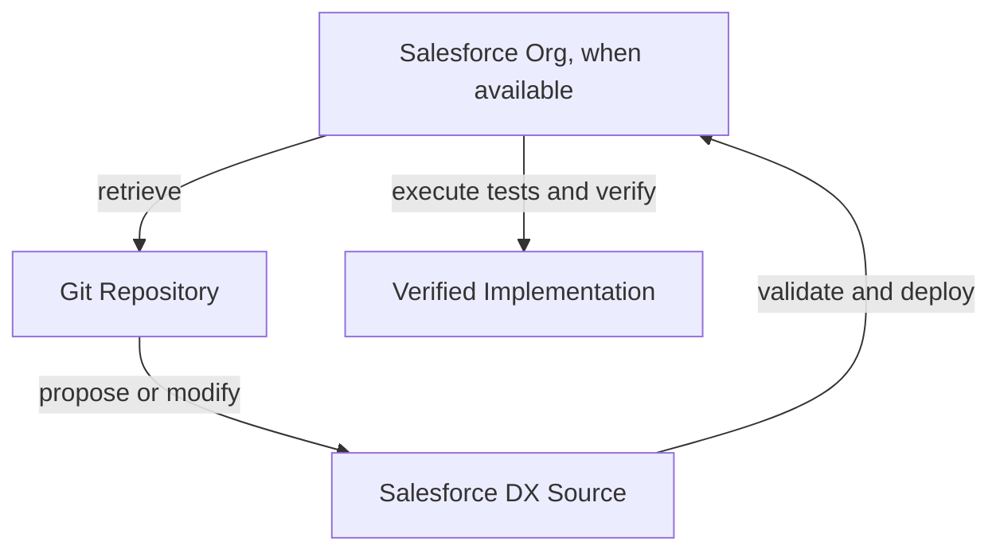

# Contributing

## Project status and source provenance

This is a Salesforce DX project with proposed implementation source authored for academic/project demonstration. Source files in this repository are not proof of Salesforce deployment or org verification. When the org is unavailable, contributors may propose coherent source/configuration and must label it as proposed. If retrieved org metadata later becomes available, treat it as the implementation source of truth and reconcile the proposal carefully.

## Recommended workflow

1. Inspect repository files and available Salesforce metadata.
2. Retrieve actual metadata when authorized org access exists; do not block independent repository work when it does not.
3. Review API names, relationships, behavior, and security. If authoring a proposal, state assumptions and keep files consistent.
4. Make changes in Salesforce DX source control.
5. Validate/deploy to a disposable Salesforce org when access is available.
6. Run relevant Apex tests and verify functionality/security in the org.
7. Commit reviewed changes with a small, meaningful message.
8. Push changes without rewriting shared history.

## Safety and quality

- Keep credentials, tokens, auth files, private keys, session IDs, passwords, and customer data out of Git.
- Keep Apex bulk-safe and enforce appropriate Salesforce security.
- Run Apex tests after Apex changes when an org is available; do not report unrun tests as passed.
- Report coverage only from actual Salesforce test results.
- Update docs and PROJECT_STATUS.md to distinguish source inclusion, design, deployment, and live verification.
- Preserve existing work; do not delete it without confirmation.

