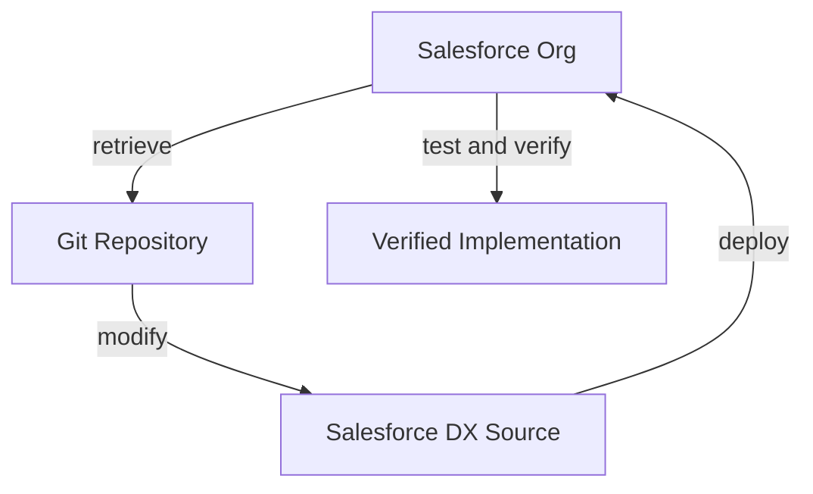

# Contributing

## Source-of-truth rule

The Salesforce org and metadata retrieved from it are the source of truth for implementation details. Requirements in this repository describe the target design, not proof that a feature exists. Inspect current metadata before making changes; do not invent or duplicate metadata.

## Recommended workflow

1. Connect to the authorized Salesforce org and retrieve the relevant metadata.
2. Review retrieved changes and confirm API names and existing behavior.
3. Make changes in Salesforce DX source control.
4. Deploy to the intended Salesforce org.
5. Run relevant Apex tests.
6. Verify functionality and security in the org.
7. Commit the reviewed changes.
8. Push the commit to the repository.

## Safety and quality

- Keep authentication/session files, credentials, tokens, keys, and secrets out of Git.
- Keep Apex bulk-safe and enforce appropriate Salesforce security.
- Run tests after Apex changes and report results only when actually observed.
- Update documentation and [PROJECT_STATUS.md](PROJECT_STATUS.md) only when supported by retrieved metadata or executed verification.
- Use small, meaningful commits. Do not force-push or rewrite shared history.
