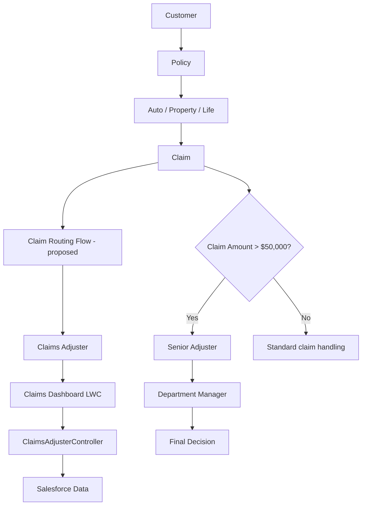

# Multi-Line Insurance Policy and Claims Management System

A Salesforce DX project proposal for managing Auto, Property, and Life policies and their claims. This repository contains proposed Salesforce source and configuration for academic evaluation; it has not been retrieved from, deployed to, or verified in a live Salesforce org.

> **Submission status:** project design, representative source, and configuration are included. Live Salesforce deployment, org execution, approval routing, permissions, and measured Apex coverage remain **not verified**.

## Overview

The solution is intended to centralize customer, policy, and claim work across three insurance lines:

- Auto Insurance
- Property Insurance
- Life Insurance

The legacy process can involve manual policy quotation, slow policy issuance, inconsistent processing, manual claim handling, delayed claim resolution, fragmented customer/policy/claim information, poor customer experience, and high operational cost.

The proposed Salesforce solution brings policy and claim data together, supports premium calculation, automates claim routing, provides a claims adjuster dashboard, and defines approval and security patterns. The project source is representative and must be validated and adapted in a Salesforce org before use.

## Objectives

- Centralize policy information.
- Automate premium calculation.
- Automate claim routing.
- Improve claims processing.
- Provide a claims adjuster dashboard.
- Support approval workflows.
- Enforce role-based access.
- Improve maintainability and scalability.

## Technology stack

| Area | Technology |
|---|---|
| Platform | Salesforce |
| Server-side logic | Apex, SOQL |
| User interface | Lightning Web Components |
| Automation | Salesforce Flow (target design) |
| Data | Custom Objects, Record Types, Validation Rules |
| Access control | Permission Sets, Sharing Rules (target configuration) |
| Approvals | Salesforce Approval Processes (target configuration) |
| Source control | Salesforce DX, Git, GitHub |

## Architecture

**Proposed architecture — design only; not live-verified.**



## Main features

- **Policy management:** proposed Policy object with Auto, Property, and Life record types and line-specific field sets.
- **Policy validation:** proposed checks requiring VIN for Auto and positive square footage for Property.
- **Premium calculation:** Apex example with explicit illustrative rates; not an approved insurance pricing model.
- **Claim management:** proposed Claim object related to a customer Account and Policy, with severity, amount, territory, adjuster, and approval status.
- **Claims dashboard:** LWC that retrieves up to 200 visible claims and supports client-side search and status/territory filters.
- **Approval hand-off:** Apex examples for Salesforce approval submission and work-item decisions; an active approval process and its approvers must be configured separately.
- **Access design:** example Agent, Adjuster, and Manager permission sets. Record visibility and territory sharing require org-specific configuration and verification.

## Project structure

```text
force-app/main/default/
├── applications/       # Salesforce application metadata (not yet configured)
├── approvalProcesses/  # Approval process design documented; org routing not configured
├── classes/            # Apex services and tests
├── flows/              # Flow designs documented; no unvalidated Flow XML
├── labels/             # Custom label metadata
├── layouts/            # Page layout metadata
├── flexipages/         # Lightning page metadata
├── lwc/                # Claims dashboard and reusable claim tile
├── objects/            # Proposed Policy__c and Claim__c definitions
├── permissionsets/     # Proposed Agent, Adjuster, and Manager access examples
├── sharingRules/       # Org-specific sharing design documented
└── tabs/               # Salesforce tab metadata
docs/                   # Design, requirements, test, demo, and deployment guides
scripts/                # Local helper guidance; no org credentials or deployment automation
sample-data/            # Sample-data guidance; no real customer data
```

## Setup and local review

Prerequisites: Git, Salesforce CLI, and access to a disposable Salesforce org for deployment validation.

```bash
git clone https://github.com/mrmaaridhanush57-design/Multiline-insurance-policy-resource.git
cd Multiline-insurance-policy-resource
sf --version
sf project deploy start --help
```

Review the proposed field names, security, sample pricing logic, and approval assumptions before deploying. Follow [docs/deployment.md](docs/deployment.md) for the org workflow. Do not put credentials, auth files, or customer data in this repository.

## Demo

The [viva/demo script](docs/demo-script.md) provides a presentation sequence. It describes intended behavior and requires a configured org to demonstrate actual runtime behavior.

## Testing

Representative Apex tests are included. **Tests are included and should be executed in a Salesforce org before deployment.** No test run or coverage result is claimed here. See [the test plan](docs/testing.md).

## Implementation status

This repository represents a **proposed/project implementation** with source examples and configuration artifacts. Live Salesforce deployment status must be verified separately. Some metadata, including Flows and the approval process setup, remains design-only. See [PROJECT_STATUS.md](PROJECT_STATUS.md).

## Future enhancements

- Configure and verify a multi-step approval process and routing criteria.
- Replace illustrative premium rates with approved, versioned business rules.
- Implement and test state/territory-aware record sharing.
- Add pagination and dashboard metrics for larger claim volumes.
- Add Flow implementations after target-org design review.
- Add LWC Jest tests and a CI pipeline after selecting a supported Salesforce DX build environment.
- Add reporting dashboards, audit history, and operational monitoring.

## Documentation

- [Business requirements](docs/business-requirements.md)
- [Architecture](docs/architecture.md)
- [Data model](docs/data-model.md)
- [Automation](docs/automation.md)
- [Apex](docs/apex.md)
- [Lightning Web Components](docs/lwc.md)
- [Approval process](docs/approval-process.md)
- [Security](docs/security.md)
- [Testing](docs/testing.md)
- [Deployment](docs/deployment.md)
- [Demo script](docs/demo-script.md)
- [Contribution workflow](CONTRIBUTING.md)
