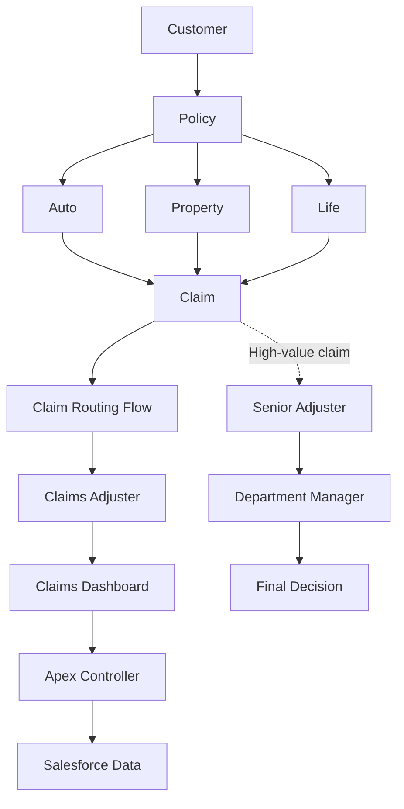

# Multi-Line Insurance Policy and Claims Management System

## Project overview

This project is a Salesforce-based insurance management solution designed to manage multiple insurance lines:

- Auto Insurance
- Property Insurance
- Life Insurance

The target system is intended to automate policy quotation, policy processing, claim initiation, claim routing, claim handling, claim approval, claims visibility, and claims adjuster operations.

> **Repository initialization complete. Salesforce implementation metadata will be synchronized from the Salesforce org after the repository foundation is established.**
>
> No Salesforce implementation metadata has been imported or verified in this repository. All capabilities described here are target requirements, not claims of existing functionality.

## Business problem

The legacy insurance process is affected by manual policy quotation, slow policy issuance, inconsistent policy processing, manual claim handling, long claim resolution times, high operational costs, fragmented customer/policy/claim information, and poor customer experience.

Salesforce is the intended platform for addressing these problems through centralized data, Flow automation, Apex business logic, Lightning Web Components (LWC), approval processes, Salesforce security, and reporting/dashboard capabilities. These are architectural intentions; their implementation must be verified from the Salesforce org.

## Project objectives

1. Standardize insurance policy management.
2. Support Auto, Property, and Life insurance.
3. Automate policy quotation.
4. Calculate premiums using Apex business logic.
5. Automate claim routing.
6. Provide a Claims Adjuster dashboard.
7. Support claim approval workflows.
8. Implement role-based access.
9. Restrict claim visibility by state/territory where required.
10. Provide automated and tested Salesforce functionality.
11. Maintain the implementation using Salesforce DX and Git.

## Target architecture

**TARGET ARCHITECTURE — conceptual only; no component is asserted to be implemented.** See [docs/architecture.md](docs/architecture.md).

## Target Salesforce data model

The intended conceptual custom objects are `Policy__c` and `Claim__c`. Expected information may include:

- **Policy:** Policy Number, Customer, Policy Type, Status, Premium, Coverage, Start Date, End Date.
- **Claim:** Claim Number, Policy, Customer, Claim Type, Claim Amount, Severity, Status, Approval Status, Assigned Adjuster, State/Territory, Claim Date, Description.

These names and fields are requirements, **not confirmation that objects or fields exist**. Actual API names and relationships must be determined from the Salesforce org during metadata retrieval. See [docs/data-model.md](docs/data-model.md).

## Target configuration and automation

- **Policy record types:** Auto, Property, Life.
- **Intended field sets:** `Auto_Fields` (VIN, Model Year); `Property_Fields` (Square Footage).
- **AutoQuotingFlow:** Customer → Auto policy information → VIN / Model Year / Coverage → premium calculation → policy creation/update → success message.
- **PremiumCalculator:** reusable premium calculation based on policy information. The production calculation must come from the actual Salesforce implementation; no insurance formula is specified here.
- **Claim record-triggered Flow:** evaluate Policy Type, Claim Severity, and Claim Amount to route claims appropriately.

These are target requirements. Do not create metadata based only on this documentation.

## Target Apex and LWC components

Expected Apex components include `PremiumCalculator` for reusable server-side premium logic and `ClaimsAdjusterController` to retrieve claims, related policy and customer information, and dashboard data for an LWC using suitable wrapper/data-transfer structures. Potential test classes are `PremiumCalculatorTest` and `ClaimsAdjusterControllerTest`. Approval-related Apex, if any, must be imported from actual org metadata.

Expected LWCs are `claimsDashboardLwc` (claim metrics and list, search, filters, loading, error, and empty states) and reusable `claimTileLwc` (individual claim display). No placeholder components are included. See [docs/apex.md](docs/apex.md) and [docs/lwc.md](docs/lwc.md).

## Target approval and security requirements

Claims with an amount **greater than $50,000** are intended to route to a Senior Adjuster, then a Department Manager, for final approval or rejection. This is a project requirement; actual Salesforce configuration must be verified against the org.

Intended roles are Agent (quotation/policy activities), Adjuster (claim handling), and Manager (approval/review). Expected Salesforce controls include Profiles, Permission Sets, object permissions, Field-Level Security, Sharing Rules, record-level security, and state/territory-based claim access. None is claimed to be implemented. See [docs/approval-process.md](docs/approval-process.md) and [docs/security.md](docs/security.md).

## Testing target

Apex tests should cover PremiumCalculator, ClaimsAdjusterController, and claim approval logic where applicable. **Target: 95%+ Apex code coverage.** Actual coverage must come from Salesforce test execution; no test results or coverage are asserted here. See [docs/testing.md](docs/testing.md).

## Salesforce DX and development

The Salesforce DX package directory is `force-app`. It currently contains no Salesforce metadata. Retrieve actual metadata from the org before editing implementation details. Follow [CONTRIBUTING.md](CONTRIBUTING.md), [docs/deployment.md](docs/deployment.md), and the repository guidance in [AGENTS.md](AGENTS.md).

## Project status

All implementation components are **Not Verified**. Track verification in [PROJECT_STATUS.md](PROJECT_STATUS.md).
