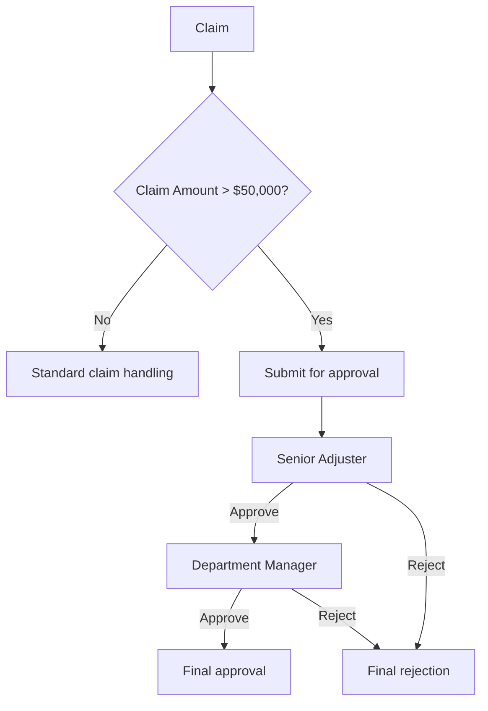

# Approval Process

> **Proposed workflow.** No Salesforce approval-process definition or org configuration is included or deployed.

## Target path

For a claim amount **greater than $50,000**:

Exactly $50,000 does not meet the greater-than condition. The Apex sample enforces that boundary.

## Proposed statuses

- Approval Status: Not Required, Pending Senior Adjuster, Pending Department Manager, Approved, Rejected.
- Claim Status: New, In Review, Pending Approval, Approved, Rejected, Closed.

The values are sample picklist values in proposed metadata. Configure process field updates so status values remain synchronized with actual approval actions.

## Configuration needed in an org

Create an active Approval Process on Claim__c with criteria for Claim_Amount__c > 50000; define the Senior Adjuster first approver, Department Manager second approver, rejection/final actions, and allowed submitters. Decide how approver identity is resolved (user, queue, hierarchy, or another approved assignment mechanism). The Apex submitter assumes a suitable active process exists.

## Actual status

The Apex submit/decision helpers are included as source. Approval steps, approver assignments, and end-to-end approval execution are **not deployed or live-verified**.
