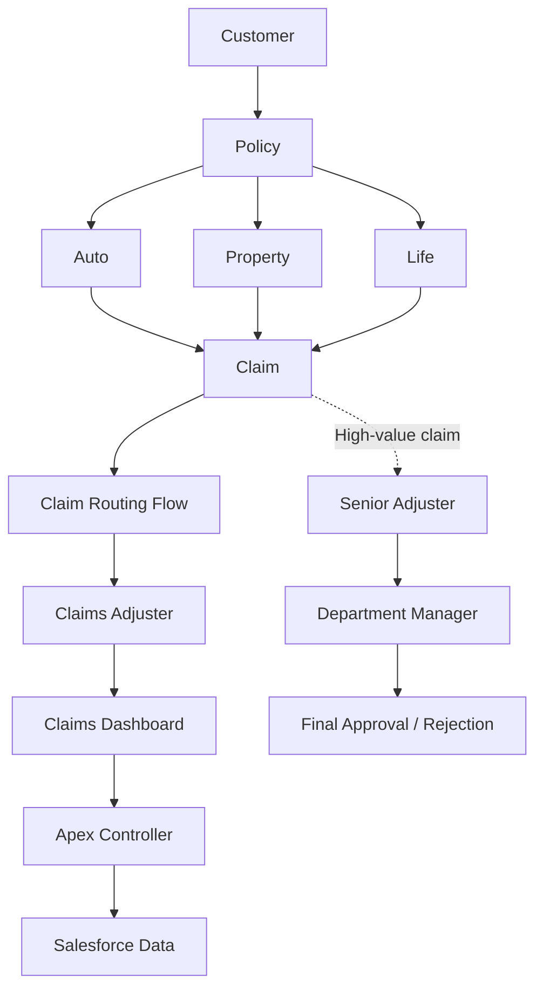

# Architecture

## Target design

**TARGET DESIGN — conceptual architecture only.** No Salesforce component is asserted to exist or be implemented. Actual architecture must be revised after org metadata is retrieved and reviewed.

Intended journey: customer and policy information spans Auto, Property, and Life lines; claims are routed to adjusters and surfaced on a dashboard. A high-value claim may enter the senior-adjuster and department-manager approval path. Exact relationships, automation, and UI integration remain to be verified.

## Actual implementation

**Not verified.** Import and inspect the Salesforce metadata before documenting deployed components, dependencies, or behavior.
