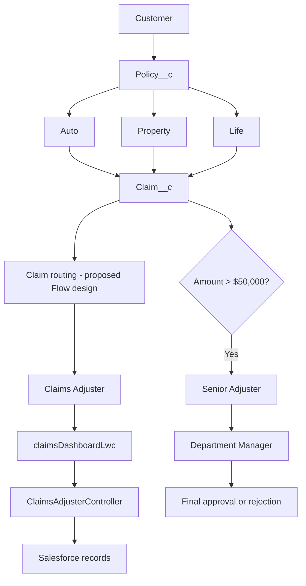

# Architecture

> **Proposed implementation:** this diagram describes source in this repository and target configuration. It is not a live-org deployment diagram.

## Components

- **Data:** proposed Policy__c and Claim__c metadata, with Account and User lookups.
- **Server-side:** Apex premium sample, claims dashboard query/DTO, and approval request/decision helpers.
- **User interface:** a dashboard LWC and reusable claim tile.
- **Automation:** Auto quoting and claim routing are designed in documentation; Flow metadata is intentionally deferred for org-specific configuration and validation.
- **Access:** proposed permission-set examples. Record sharing and state/territory isolation require a separate verified sharing design.

## Actual status

Source files are included in this repository. No component has been compiled or deployed in a Salesforce org.
