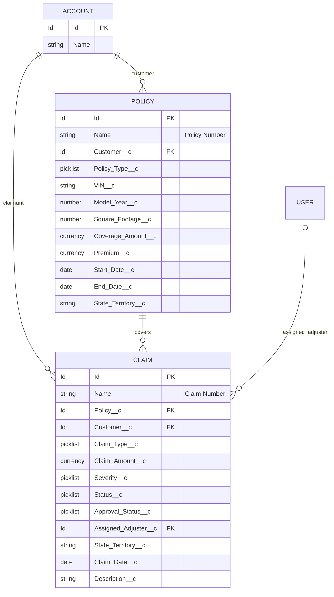

# Data Model

> **Proposed Salesforce source.** API names in this repository are a project design and were not retrieved from an org. Confirm naming, ownership, requiredness, and relationships before deployment.

## Conceptual entities

- **Customer:** represented in this proposal by the standard Salesforce Account object. A person-account org may choose another model.
- **Policy (Policy__c):** one insurance contract, linked to an Account.
- **Claim (Claim__c):** a loss or event, linked to a Policy and Account. The Account lookup is stored on Claim for simple dashboard access; keep it consistent with the selected policy in production.

## Proposed Policy fields

| Field | Type | Purpose |
|---|---|---|
| Name | Auto Number | Policy Number (POL-{00000}) |
| Customer__c | Lookup(Account) | Policy customer |
| Policy_Type__c | Restricted picklist | Auto, Property, Life |
| Status__c | Restricted picklist | Draft, Quoted, Pending, Active, Expired, Cancelled |
| Premium__c | Currency | Proposed annual premium amount |
| Coverage_Amount__c | Currency | Coverage basis for the sample calculator |
| Start_Date__c / End_Date__c | Date | Policy term |
| VIN__c | Text(17) | Auto identification; required by proposed validation when Auto |
| Model_Year__c | Number(4,0) | Auto detail |
| Square_Footage__c | Number(10,0) | Property detail; must be positive when Property |
| State_Territory__c | Text(80) | Proposed territory attribute; does not implement sharing by itself |

### Policy record types and field sets

- Record Types: **Auto**, **Property**, **Life**.
- Field Sets: **Auto_Fields** (VIN, Model Year) and **Property_Fields** (Square Footage).

## Proposed Claim fields

| Field | Type | Purpose |
|---|---|---|
| Name | Auto Number | Claim Number (CLM-{00000}) |
| Policy__c | Lookup(Policy__c) | Related policy |
| Customer__c | Lookup(Account) | Claim customer |
| Claim_Type__c | Restricted picklist | Auto, Property, Life |
| Claim_Amount__c | Currency | Reported claim amount |
| Severity__c | Restricted picklist | Low, Medium, High, Critical |
| Status__c | Restricted picklist | New, In Review, Pending Approval, Approved, Rejected, Closed |
| Approval_Status__c | Restricted picklist | Not Required, Pending Senior Adjuster, Pending Department Manager, Approved, Rejected |
| Assigned_Adjuster__c | Lookup(User) | Proposed assignee |
| State_Territory__c | Text(80) | Business territory attribute |
| Claim_Date__c | Date | Claim date |
| Description__c | Long Text Area | Claim summary |

Claim Record Types: **Auto Claim**, **Property Claim**, and **Life Claim**.

## Relationship and integrity notes

Policy-to-Claim is one-to-many. Both Policy and Claim relate to Account. Because Claim stores both Policy and Account, production automation should prevent mismatched customer/policy pairs. The territory fields are data attributes only; they do not provide security without a deliberate sharing design.

## Actual verified status

The definitions under force-app/main/default/objects/ are proposed source files in this repository. They are not evidence of deployed objects or metadata in any live org.
